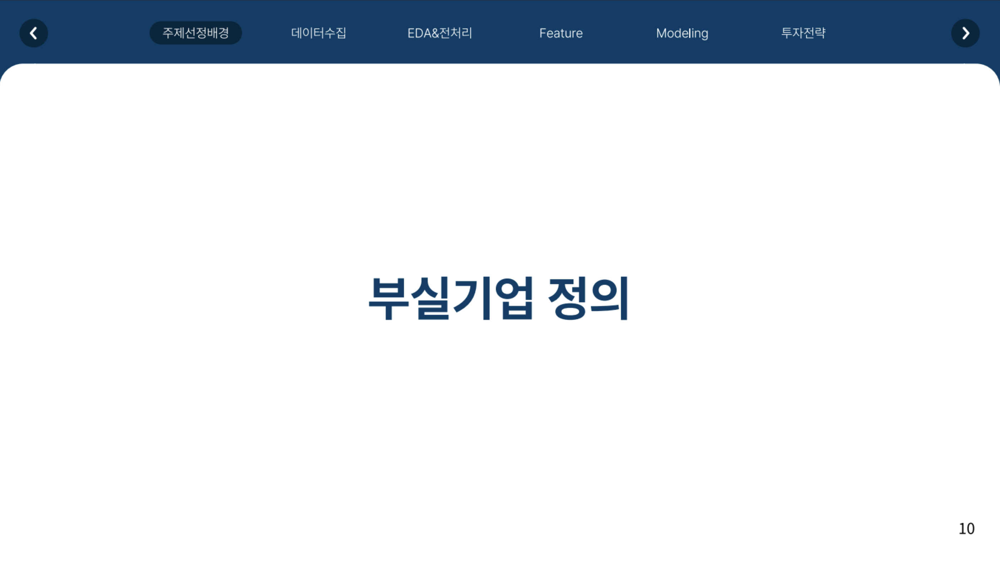
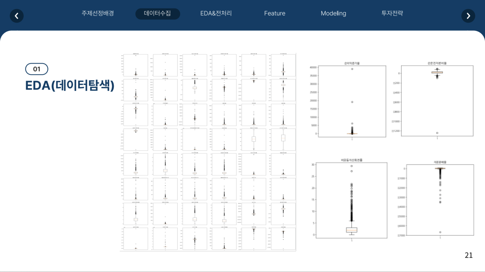
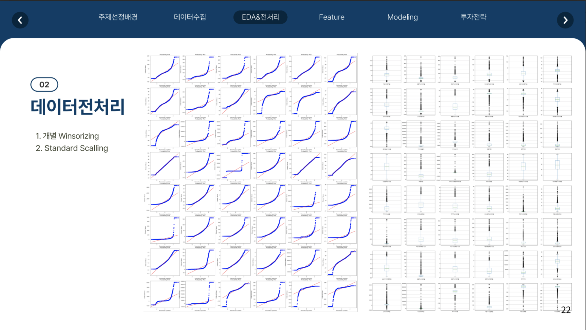

# 🧠 경기국면을 고려한 부실기업 예측 및 코스닥 초과수익률 검증

> 개인 프로젝트 | Business Cycle-aware Distress Prediction & KOSDAQ Outperformance Strategy

---

## 1. 개요 (Project Overview)

본 프로젝트는 경기 국면을 고려한 부실 예측 모델을 구축하고, 해당 예측 결과를 기반으로 투자 전략을 수립하는 것을 목적으로 합니다.

### 프로젝트 수행 순서

1. 경기 국면에 따른 데이터셋 분할
2. 통계 기반 피처 선택 및 모델 학습
3. 데이터 불균형 처리
4. 예측 성능 평가 (Recall 우선)
5. 투자 전략 수립 및 백테스팅 검증

---

## 2. 경기 국면 기준 (Business Cycle Reference)

- 통계청 제공 **월별 경기 국면 데이터**와 **연도별 기업 재무 데이터** 활용
- **6월 이전은 해당 연도 재무 데이터**, **6월 이후는 다음 연도 재무 데이터** 사용

---

## 3. 데이터 분할 기준 (Dataset Construction)

| 구분 | 기간 | 특징 | 기업 수 (정상 / 부실) |
|------|------|------|------------------------|
| Train Set | 2011~2013 | 수축 국면 포함 | 1,320개 (1,248 / 72) |
| Test Set 1 | 2014~2018 | 확장 국면 | 3,823개 |
| Test Set 2 | 2019~2020 | 수축 국면 | 2,009개 |

---

## 4. 피처 선택 기준 (Feature Selection)

1. **1차**: t-test (p < 0.05)로 유의미한 변수 선택  
2. **2차**: Logistic Regression + Lasso 정규화  
3. **3차**: t-test & Lasso 공통 피처 10개 최종 선정  

### 📌 최종 선정 피처 (총 10개)

| 항목 | 피처 |
|------|------|
| 수익성 | 자기자본순이익률, 1주당매출액 |
| 성장성 | 총자본증가율, 순이익증가율 |
| 생산성 | 총자본투자효율, 설비투자효율 |
| 안정성 | 자기자본비율, 순운전자본비율 |
| 활동성 | 매출채권회전률, 1회전기간 |

---

## 5. 데이터 불균형 처리 (Data Imbalance Handling)

- 원본 데이터의 정상:부실 비율 약 **17:1**
- 불균형으로 인한 **편향된 학습**, **일반화 성능 저하** 문제 발생
- **SMOTE 기법**을 활용하여 부실기업 오버샘플링 → **1:1 비율로 조정**

---

## 6. 모델 성능 평가 기준 (Model Evaluation)

- **부실기업 놓침(False Negative)**을 최소화해야 함 → **Recall 우선**
  
### ✅ Test Set 1 (확장 국면, SMOTE 적용 후)

| 모델 | Recall |
|------|--------|
| XGBoost | **0.9250** |
| Random Forest | 0.9125 |
| Decision Tree | 0.7875 |

### ✅ Test Set 2 (수축 국면)

| 모델 | Recall |
|------|--------|
| Random Forest | **0.8878** |
| Logistic Regression | 0.7857 |
| XGBoost | 0.7876 |

---

## 7. 투자 전략 수립 (Investment Strategy)

### 투자 Flow

1. **정상기업 선별**: 부실 예측 결과 기반 필터링
2. **시가총액 필터링**: 하위 20% 제외 (변동성 리스크 감소)
3. **점수화**: 예측 점수 기반 스코어링
4. **Top 10 선정**: 연도별 상위 10개 기업 투자

### 📈 매매 전략 (Buy & Hold)

- **매수**: 4월 1주차 (재무제표 공시 직후)
- **매도**: 다음 해 3월 말

---

## 8. 연도별 투자 대상 기업 예시

### Test Set 1 (확장 국면, 2014~2018)

- (주)유진로봇  
- (주)웹스  
- (주)비츠로테크  
- (주)엔브이에이치코리아 등

### Test Set 2 (수축 국면, 2019~2020)

- (주)텔레칩스  
- (주)엠플러스  
- (주)미스터블루  
- (주)바이오로그디바이스 등

---

## 9. 백테스팅 결과 (Backtesting Result)

- **Benchmark**: KOSDAQ 수익률

| 구분 | 기간 | 전략 성과 |
|------|------|------------|
| 확장 국면 | 2013~2019 | 누적 수익률 기준 전략이 KOSDAQ 상회 |
| 수축 국면 | 2019~2021 | 전략 적용 시 안정적인 초과 수익 확보 |

---

## 10. 결론 (Conclusion)

- 경기 국면을 고려한 부실기업 예측 모델은 **재무 안정성** 및 **성장성 지표**와 유의미한 상관관계를 가짐
- **Recall 중심 성능 평가**로 투자 손실 가능성 최소화
- **SMOTE와 피처 선별** 기법을 통해 예측 성능 극대화
- 실제 투자 전략 적용 시 **KOSDAQ 대비 안정적인 초과 수익 실현** 가능성 확인

---

  
  
  
  
  
  
  
  
  
  
  
  
  
  
  
  
  
  
  
  
  
  
  
  
  
  
  
  
  
  
  
  
  
  

